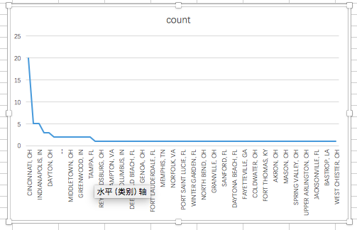
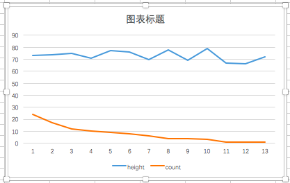
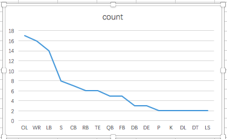
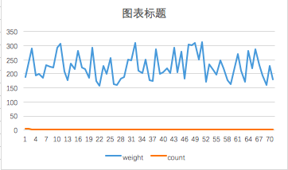
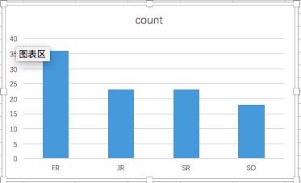

# README.md
## Question 1
--Where are most player come from

```sql
SELECT
hometown,
count(hometown)
FROM datasets.college_football_players
group by hometown
order by count(*) DESC
```


## Question 2
--What’s the highest height

```sql
SELECT
height,
count(height)
FROM datasets.college_football_players
group by height
order by count(*) DESC
```


## Question 3
--What’s the most popular position

```sql
SELECT
position,
count(position)
FROM datasets.college_football_players
group by position
order by count(*) DESC
```


## Question 4
--What is the weight most player have in the school

```sql
SELECT
Weight,
count(Weight)
FROM datasets.college_football_players
group by Weight
order by count(*) DESC
```


## Question 5
--What year are most player in

```sql
SELECT
year,
count(year)
FROM datasets.college_football_players
group by year
order by count(*) DESC
```

